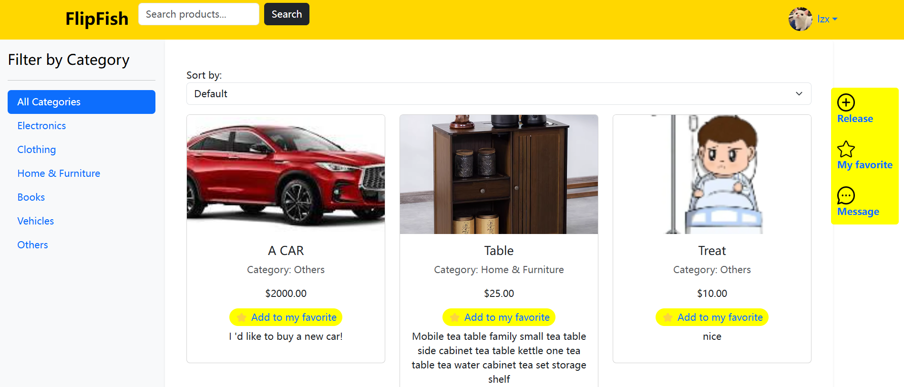
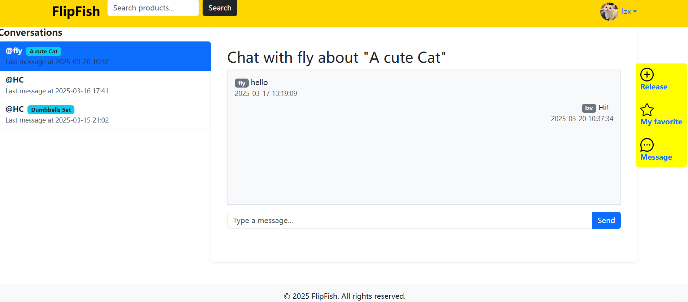

# Second-hand Trading Platform

## Introduction
The Second-hand Trading Platform is a Django-based web application designed to facilitate the buying and selling of second-hand products. It provides users with features such as user registration and login, product listing, order management, wishlist, and user reviews.



## Features
1. **User Management**:
    - User registration and login with password validation.
    - User profile management, including profile updates.
    - User balance recharge functionality.
    - Wishlist management for users to save favorite products.
2. **Product Listings**:
    - Display a list of available second-hand products on the homepage.
    - Provide detailed information about each product.
    - Allow sellers to create new product listings.
3. **Order Management**:
    - Users can place orders for products.
    - Order details can be viewed by both buyers and sellers.
    - Orders can be canceled or marked as completed.
    - Users can submit reviews for sellers after order completion.
4. **Payment Integration**:
    - Although the payment views are currently empty, the framework is set up to potentially integrate payment gateways in the future.

## Installation
### Prerequisites
- Python 3.x
- Django 4.2.18

### Steps
1. **Clone the repository**:
    ```bash
    git clone https://github.com/your-repo/Second-hand-Trading-Platform.git
    cd Second-hand-Trading-Platform
    ```
2. **Create a virtual environment**:
    ```bash
    python -m venv venv
    source venv/bin/activate  # For Linux/Mac
    .\venv\Scripts\activate  # For Windows
    ```
3. **Install dependencies**:
    ```bash
    pip install -r requirements.txt
    ```
4. **Configure the database**:
    - The project uses SQLite by default. You can find the database configuration in `Second-hand-Trading-Platform/settings.py`.
    ```python
    DATABASES = {
        'default': {
            'ENGINE': 'django.db.backends.sqlite3',
            'NAME': BASE_DIR / 'db.sqlite3',
        }
    }
    ```
5. **Run migrations**:
    ```bash
    python manage.py makemigrations
    python manage.py migrate
    ```
6. **Start the development server**:
    ```bash
    python manage.py runserver
    ```

## Directory Structure
```
Second-hand-Trading-Platform/
├── apps/
│   ├── listings/
│   │   ├── admin.py
│   │   ├── apps.py
│   │   ├── models.py  # Not shown in snippets but assumed
│   │   ├── urls.py
│   │   └── views.py
│   ├── orders/
│   │   ├── admin.py  # Not shown in snippets but assumed
│   │   ├── models.py  # Not shown in snippets but assumed
│   │   └── views.py
│   ├── payments/
│   │   ├── admin.py
│   │   └── views.py
│   └── users/
│       ├── admin.py
│       ├── forms.py  # Not shown in snippets but assumed
│       ├── models.py  # Not shown in snippets but assumed
│       ├── urls.py  # Not shown in snippets but assumed
│       └── views.py
├── admin_panel/
│   └── admin.py
├── Second-hand-Trading-Platform/
│   ├── settings.py
│   ├── urls.py  # Not shown in snippets but assumed
│   ├── wsgi.py
│   └── asgi.py
├── .idea/
│   ├── inspectionProfiles/
│   │   ├── Project_Default.xml
│   │   └── profiles_settings.xml
│   ├── jsLibraryMappings.xml
│   ├── dataSources.xml
│   ├── vcs.xml
│   ├── modules.xml
│   └── misc.xml
├── templates/  # Not shown in snippets but assumed
├── static/  # Not shown in snippets but assumed
├── media/  # Not shown in snippets but assumed
└── requirements.txt
```

## Usage
1. **User Registration and Login**:
    - Navigate to the registration page to create a new account.
    - Log in using your username and password.
2. **Product Listing**:
    - Sellers can create new product listings by clicking the "New Product" button.
    - Buyers can browse the available products on the homepage.
3. **Order Placement**:
    - Click the "Buy Now" button on a product page to place an order.
4. **Order Management**:
    - View order details on the order list page.
    - Cancel or complete orders as needed.
5. **Wishlist**:
    - Add products to your wishlist by clicking the "Add to Wishlist" button.
    - View and manage your wishlist on the wishlist page.
6. **User Reviews**:
    - After an order is completed, buyers can submit reviews for sellers.

## Contributing
If you would like to contribute to this project, please follow these steps:
1. Fork the repository.
2. Create a new branch for your feature or bug fix.
3. Make your changes and commit them with descriptive messages.
4. Push your changes to your forked repository.
5. Submit a pull request to the main repository.


## Contact
If you have any questions or suggestions, please contact lzhaoxi6@gmail.com.